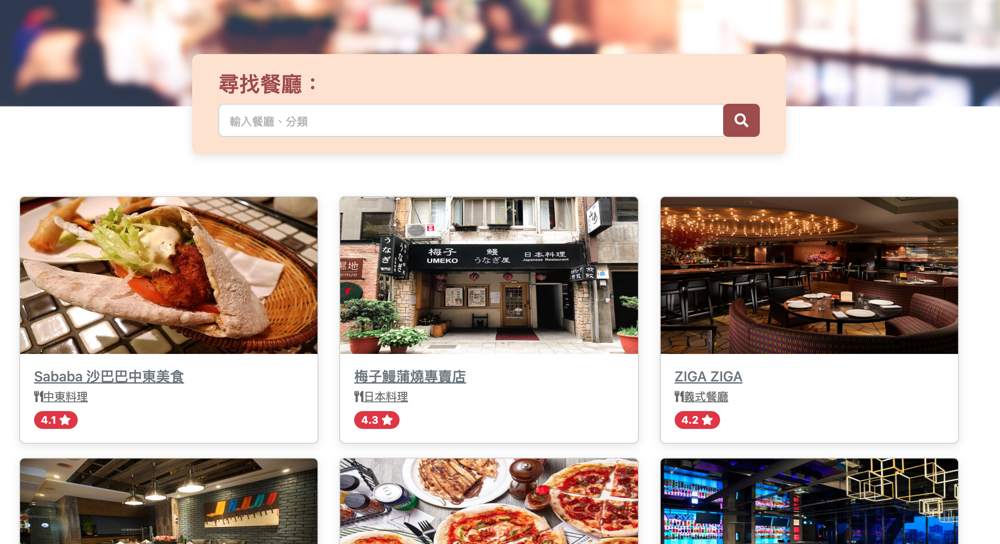

# 餐廳清單

---

# Function
* 使用者可以在首頁看到所有餐廳與它們的簡單資料
* 使用者可以再點進去看餐廳的詳細資訊
* 使用者可以透過搜尋餐廳名稱來找到特定的餐廳
* 使用者可以透過搜尋餐廳類別來找到特定的餐廳

# How to use
複製專案到你的電腦上

`$ git clone https://github.com/Lyle53/Restaurant-list.git`

讓終端機進入你專案的資料夾內

` $ cd /Restaurant-list `

安裝npm

` $ npm install `

啟動專案(因為我們有將package.json的script改過了)

` $ npm run dev `

之後點選成功後的網址

` Listening :  http://localhost:3000 `

